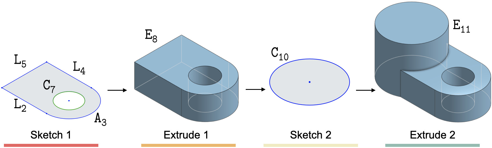

# DeepCAD
This repository provides source code for our paper:

[DeepCAD: A Deep Generative Network for Computer-Aided Design Models](https://arxiv.org/abs/2105.09492)

[Rundi Wu](https://chriswu1997.github.io), [Chang Xiao](http://chang.engineer), [Changxi Zheng](http://www.cs.columbia.edu/~cxz/index.htm)

ICCV 2021 (camera ready version coming soon)

<p align="center">
  
</p>

We also release the Onshape CAD data parsing scripts here: [onshape-cad-parser](https://github.com/ChrisWu1997/onshape-cad-parser).

## 🧑‍💻 Prerequisites

- Linux
- NVIDIA GPU + CUDA CuDNN
- Python 3.7, PyTorch 1.5+


## 👬 Dependencies

Install python package dependencies through pip:

```bash
$ pip install -r requirements.txt
```

Install [pythonocc](https://github.com/tpaviot/pythonocc-core) (OpenCASCADE) by conda:

```bash
$ conda install -c conda-forge pythonocc-core=7.5.1
```

---
## 📦 Data

Download data from [here](http://www.cs.columbia.edu/cg/deepcad/data.tar) ([backup](https://drive.google.com/drive/folders/1mSJBZjKC-Z5I7pLPTgb4b5ZP-Y6itvGG?usp=sharing)) and extract them under `data` folder. 
- `cad_json` contains the original json files that we parsed from Onshape and each file describes a CAD construction sequence. 
- `cad_vec` contains our vectorized representation for CAD sequences, which serves for fast data loading. They can also be obtained using `dataset/json2vec.py`.
TBA.
- `train_val_test_split.json` contains a json file with a reference to all the directories and files split into train, validation and test buckets. See below

- Some evaluation metrics that we use requires ground truth point clouds. Run:
  ```bash
  $ cd dataset
  $ python json2pc.py --only_test
  ```
The data we used are parsed from Onshape public documents with links from [ABC dataset](https://archive.nyu.edu/handle/2451/61215). We also release our parsing scripts [here](https://github.com/ChrisWu1997/onshape-cad-parser) for anyone who are interested in parsing their own data.

####  🗂️ Test/Validation/Train Data split
`🗂️ data/train_val_test_split.json` contains a json file with a reference to all the directories and files split into train, validation and test buckets. The format is as follows: 
```js
// 👉 json[bucket][directory/file]
{
  "train": {
    "0098/00980001"
  },
  "validation": {

  },
  "test": {

  },
}
```
where `train` is the bucket, `0098` is the directory under `cad_json` and `00980001` is the json file `00980001.json`

> eg. before
```
🗂️ data
   + 🗂️ cad_json
      + 🗂️ 0098
        +  📄 00980001.json
``````

after running the code in 👉`dataset/json2vec.py` these files will be converted into vectors and stored as an `h5` file

```py
"""
@see 👉`dataset/json2vec.py`
"""

"""
 @step Load CADSequence data from a dictionary
"""
cad_seq = CADSequence.from_dict(data)

"""
 @step  Normalize the CADSequence data to fit within a standardized size
"""
cad_seq.normalize()

"""
 @step  Numericalize the CADSequence data by converting continuous values into discrete integers
"""
cad_seq.numericalize()

"""
 @step  
    Convert the CADSequence data into a vector representation with specific constraints
    
    The arguments 
        MAX_N_EXT, 
        MAX_N_LOOPS, 
        MAX_N_CURVES, 
        MAX_TOTAL_LEN 
    determine the maximum limits.

    These are set in 👉cadlib/macro.py

    pad=False indicates that the output vector won't be padded if the constraints are not met
"""
cad_vec = cad_seq.to_vector(
    MAX_N_EXT, 
    MAX_N_LOOPS, 
    MAX_N_CURVES, 
    MAX_TOTAL_LEN, 
    pad=False,
)

```


> data folder after json 2 vec: 
```
🗂️ data
   + 🗂️ cad_json
      + 🗂️ 0098
        +  📄 00980001.json
   + 🗂️ cad_vec
      + 🗂️ 0098
        +  📄 00980001.h5
``````


---
## 🏋️ Training
### 🏋️ Pre-trained models

Download pretrained model from [here](http://www.cs.columbia.edu/cg/deepcad/pretrained.tar) ([backup](https://drive.google.com/file/d/16RzOChCdLM5L1VUSFpgHwqU7JoQOF2Nd/view?usp=sharing)) and extract it under `proj_log`. All testing commands shall be able to excecuted directly, by specifying `--exp_name=pretrained` when needed.

### 🏋️ Training models
See all hyper-parameters and configurations under `config` folder. 

##### 🏋️ LGAN configuration arguments
The list of arguments that can be passed to the `lgan.py`  file. The list is configured in the 👉`config/configLGAN.py` file
```bash
# ----------------
# 🏋️ lgan example:
# ----------------
#   🎃exp_name - Name of the experiment
#   🗂️proj_dir - Name of the project directory which is `proj_log` by default
#   ⛳️ae_ckpt - Checkpoint for the autoencoder
#   💻gpu_ids - GPU(s) to use 
#
#  👉folder: 🗂️proj_log/newDeepCAD
#
python lgan.py --exp_name newDeepCAD --ae_ckpt 1000 -g 0
```


| Argument Name | Type   | Default Value | Description                                                |
| -------------- | ------ | ------------- | ---------------------------------------------------------- |
| proj_dir       | str    | proj_log      | Path to the project folder where models and logs are saved |
| exp_name       | str    | Required      | Name of the experiment                                    |
| ae_ckpt        | str    | Required      | Checkpoint for the autoencoder                             |
| continue       | boolean| False         | Continue training from checkpoint                          |
| ckpt           | str    | latest        | Desired checkpoint to restore (optional)                   |
| test           | boolean| False         | Test mode                                                  |
| n_samples      | int    | 100           | Number of samples to generate when testing                |
| gpu_ids        | str    | 0             | GPU(s) to use (e.g., "0" for one GPU, "0,1,2" for multiple GPUs; CPU not supported) |
| batch_size     | int    | 256           | Batch size                                                 |
| num_workers    | int    | 8             | Number of workers for data loading                        |
| n_iters        | int    | 200000        | Total number of iterations to train                        |
| save_frequency | int    | 100000        | Save models every x iterations                             |
| lr             | float  | 2e-4          | Initial learning rate                                      |


##### 🏋️ Training configuration arguments
The list of arguments that can be passed to the `train.py` and/or `test.py` file. The list is configured in the 👉`config/configAE.py` file
```bash
# -----------------
# 🏋️ train example:
# -----------------
#   🎃exp_name - Name of the experiment
#   🗂️proj_dir - Name of the project directory which is `proj_log` by default
#   💻gpu_ids - GPU(s) to use 
#
#  👉folder: 🗂️proj_log/newDeepCAD
#
python train.py --exp_name newDeepCAD -g 0
```

| Argument Name    | Type    | Default Value  | Description                                                |
| ----------------- | ------- | --------------- | ---------------------------------------------------------- |
| `proj_dir`          | str     | `proj_log`        | Path to the project folder where models and logs are saved |
| `data_root`         | str     | `data`            | Path to the source data folder                            |
| `exp_name`          | str     | Current folder name | Name of the experiment                                    |
| `gpu_ids`           | str     | `0`               | GPU(s) to use (e.g., "0" for one GPU, "0,1,2" for multiple GPUs; CPU not supported) |
| `batch_size`        | int     | `512`             | Batch size                                                 |
| `num_workers`       | int     | `8`               | Number of workers for data loading                        |
| `nr_epochs`         | int     | `1000`            | Total number of epochs to train                            |
| `lr`                | float   | `1e-3`            | Initial learning rate                                      |
| `grad_clip`         | float   | `1.0 `            | Gradient clipping value                                    |
| `warmup_step`       | int     | `2000`            | Step size for learning rate warm-up                        |
| `continue`          | boolean | `False`           | Continue training from checkpoint                          |
| `ckpt`              | str     | `latest`          | Desired checkpoint to restore (optional)                   |
| `vis`               | boolean | `False`           | Visualize output during training                            |
| `save_frequency`    | int     | `500`             | Save models every x epochs                                 |
| `val_frequency`     | int     | `10`              | Run validation every x iterations                          |
| `vis_frequency`     | int     | `2000`            | Visualize output every x iterations                        |
| `augment`           | boolean | `False`           | Use random data augmentation                                |


##### Train the autoencoder
To train the autoencoder:

```bash
python train.py --exp_name newDeepCAD -g 0
```

For random generation, further train a latent GAN:

```bash
# encode all data to latent space
python test.py --exp_name newDeepCAD --mode enc --ckpt 1000 -g 0

# train latent GAN (wgan-gp)
$ python lgan.py --exp_name newDeepCAD --ae_ckpt 1000 -g 0
```

The trained models and experment logs will be saved in `proj_log/newDeepCAD/` by default. 


---
## 🧪 Testing and Evaluation

#### __Autoencoding__

  After training the autoencoder, run the model to reconstruct all test data:

  ```bash
  $ python test.py --exp_name newDeepCAD --mode rec --ckpt 1000 -g 0
  ```
  The results will be saved in`proj_log/newDeepCAD/results/test_1000` by default in the format of `h5` (CAD sequence saved in vectorized representation).

  To evaluate the results:

  ```bash
  $ cd evaluation
  # for command accuray and parameter accuracy
  $ python evaluate_ae_acc.py --src ../proj_log/newDeepCAD/results/test_1000
  # for chamfer distance and invalid ratio
  $ python evaluate_ae_cd.py --src ../proj_log/newDeepCAD/results/test_1000 --parallel
  ```

#### __Random Generation__

  After training the latent GAN, run latent GAN and the autoencoder to do random generation:

  ```bash
  # run latent GAN to generate fake latent vectors
  $ python lgan.py --exp_name newDeepCAD --ae_ckpt 1000 --ckpt 200000 --test --n_samples 9000 -g 0
  
  # run the autoencoder to decode into final CAD sequences
  $ python test.py --exp_name newDeepCAD --mode dec --ckpt 1000 --z_path proj_log/newDeepCAD/lgan_1000/results/fake_z_ckpt200000_num9000.h5 -g 0
  ```
  The results will be saved in`proj_log/newDeepCAD/lgan_1000/results` by default.

  To evaluate the results by COV, MMD and JSD:

  ```bash
  $ cd evaluation
  $ sh run_eval_gen.sh ../proj_log/newDeepCAD/lgan_1000/results/fake_z_ckpt200000_num9000_dec 1000 0
  ```
  The script `run_eval_gen.sh` combines `collect_gen_pc.py` and `evaluate_gen_torch.py`. 
  You can also run these two files individually with specified arguments.


---
## Visualization and Export
We provide scripts to visualize CAD models and export the results to `.step` files, which can be loaded by almost all modern CAD softwares.
```bash
$ cd utils
$ python show.py --src {source folder} # visualize with opencascade
$ python export2step.py --src {source folder} # export to step format
```
Script to create CAD modeling sequence in Onshape according to generated outputs: TBA.

## Acknowledgement
We would like to thank and acknowledge referenced codes from [DeepSVG](https://github.com/alexandre01/deepsvg), [latent 3d points](https://github.com/optas/latent_3d_points) and [PointFlow](https://github.com/stevenygd/PointFlow).

## Cite

Please cite our work if you find it useful:
```
@InProceedings{Wu_2021_ICCV,
    author    = {Wu, Rundi and Xiao, Chang and Zheng, Changxi},
    title     = {DeepCAD: A Deep Generative Network for Computer-Aided Design Models},
    booktitle = {Proceedings of the IEEE/CVF International Conference on Computer Vision (ICCV)},
    month     = {October},
    year      = {2021},
    pages     = {6772-6782}
}
```
